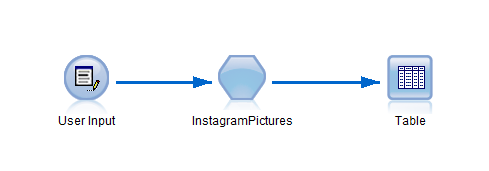
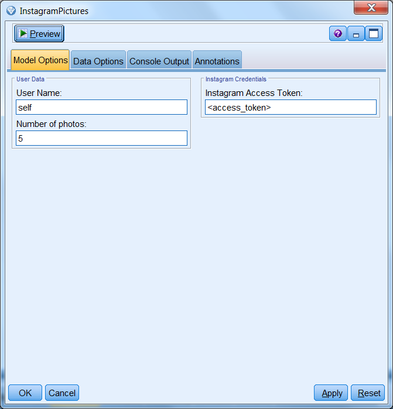
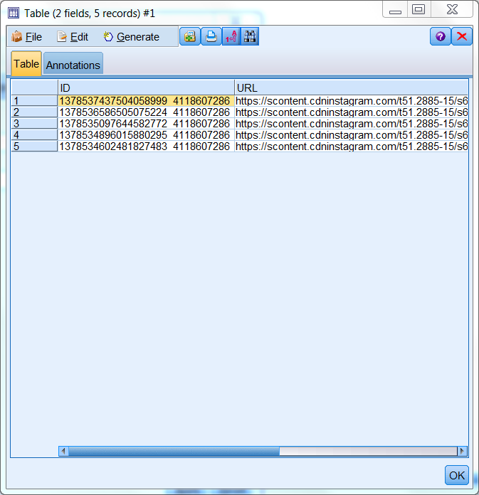

# Download pictures from Instagram account

This extension enables you to download picture ids and urls from a specified Instgram user using Instagram API Platform

  

# Before you start

1. Register as an Instagram developer.

	https://www.instagram.com/developer/register/
	
2. Follow the authentication instruction and get your 'access_token'.

	https://www.instagram.com/developer/authentication/

3. Invite Sandbox users.
	1. Go to 'Manage Clients'
	2. Find your app and click on 'MANAGE'
	3. Choose 'Sandbox' tab
	4. Type in the usernames you wish to invite
	
	more information about sandbox users:
	https://www.instagram.com/developer/sandbox/

4. SPSS Modeler and R requirements:
	- SPSS Modeler v18.0
	- SPSS Modeler 'R essentials' plugin
	- R packages: 
		- RJSONIO
		- RCurl
		
5. Install InstagramPictures extension from SPSS Modeler Extension Hub.

# Example usage

Because the node is not a true source node a dummy 'user input' node has to be connected as input to InstagramPictures node. It's values are not used by the extension.

  

	
In the node window you must provide the access_token you received earlier.
Optionally the username and number of photos you wish to aquire can be specified. Default parameters will download 5 most recent photos from the access_token owner's account.
	

  

	
	
# Output

The generated output is a table that contains the pictures unique ids and their urls.
	

  

Check out sample stream in Example directory if you run into any problems!

# License
- [Apache 2.0][1]

# Contributors
 - Artur Kucia
 
 [1]: http://www.apache.org/licenses/LICENSE-2.0.html
	
	
